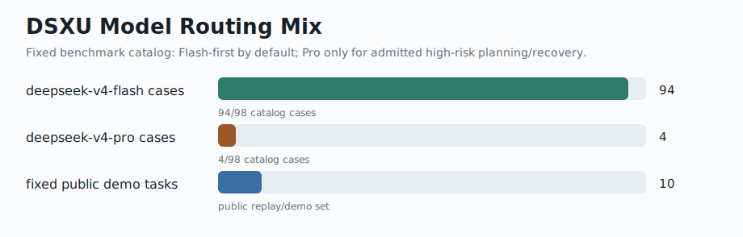
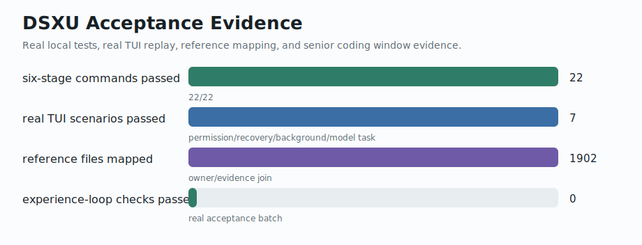
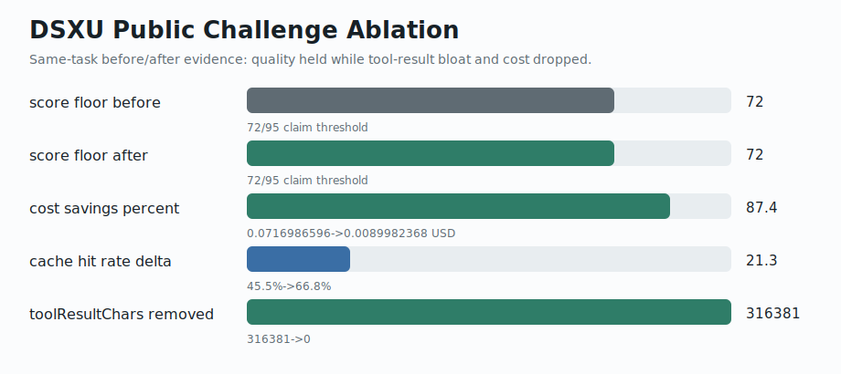
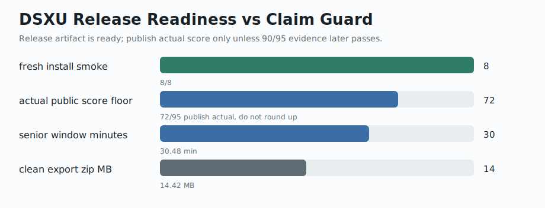

# DSXU Code

[English](README.md) | [简体中文](README.zh-CN.md)

DSXU 当前定位为开源：在 DeepSeek V4 Flash / Flash-MAX / Pro 混合模型基础上，通过强编排、工具、权限、上下文、恢复、Agent、成本和证据系统，低成本实现 AI 编程与复杂任务执行工具，拥有 Agent 长任务执行与高级程序员体验。

DSXU Code 面向真实工程工作，而不是只包一层聊天接口。它在原始模型调用外面增加工程运行时：源码事实读取、工具执行、权限门控、失败恢复、可见工作状态、Agent/Skill 边界、成本与缓存跟踪，以及有证据约束的发布检查。公开定位是：**DeepSeek-first engineering runtime with internal reality/evidence gates passed**。它不会被发布成“公开 90% / 95 分能力已证明”的榜单声明，也不会声明超过外部模型或外部产品。本文所有公开说法只限于下面列出的证据。

## DSXU 功能总览

| 能力域 | DSXU 做了什么 | 主要作用 | 当前公开边界 |
|---|---|---|---|
| DeepSeek 混合模型路由 | 默认 DeepSeek V4 Flash；复杂、审查、高风险任务才准入 Flash-MAX / Pro；记录 admission reason | 控制成本，同时保留复杂任务升级通道 | 不声明模型本身超过外部模型 |
| 强编排 / Query Loop | Task Classifier、PlanGraph、work-state projection、route latch、final gate | 把“读代码、计划、执行、验证、恢复、报告”串成一条工程主链 | 不新增第二套 runtime |
| 工具系统 | Read / Edit / Write / Bash / Search / evidence tools 等进入统一 Tool Gate | 让模型使用工具时有目的、权限、结果、证据 | 不允许工具绕过 DSXU Tool Gate |
| 权限系统 | Permission Gate、危险命令识别、文件写入/外部执行/高风险动作审计 | 防止静默修改、越权执行和误删 | 用户授权和证据记录优先 |
| 上下文系统 | Source capsule、bounded read、tool-result artifact、prompt/cache 分层 | 降低大文件反复读取和工具结果灌入上下文的问题 | cache 是优化指标，不是公开胜出指标 |
| 恢复系统 | Failure taxonomy、repair loop、replan、retry、rollback/checkpoint、stall recovery | 命令失败、测试失败、长任务卡住时能定位、修复、重跑 | 失败不会被隐藏成 PASS |
| Agent 长任务 | Agent evidence envelope、worker handoff、parent/worker 边界、long-task ledger | 支持长任务拆分、并行分析、证据回传和恢复 | Agent 不成为第二套主编排 |
| Skills 技能系统 | Skill registry、能力优先级、冲突规则、二级技能包边界 | 把可复用技能接入 DSXU 主链，提高专业任务能力 | Skills 不能覆盖主链权限和路由 |
| MCP / 外部生态 | MCP client、registry、adapter boundary、doctor 检查 | 支持外部工具接入，同时保持 DSXU-owned 边界 | 不声明内置第三方产品或独立 MCP runtime |
| 成本系统 | CostRouter、CostReporter、route/cost/cache trajectory、Pro admission ledger | 让用户看到模型选择、成本、缓存、升级原因 | GitHub 只展示真实记录数据 |
| 证据系统 | Evidence dashboard、release claim binder、blocked-claim corpus、raw evidence manifest | 让功能、测试、成本、失败和发布声明可复核 | 没有 paired raw evidence 时阻断外部比较 claim |
| TUI 信任界面 | 目标、计划、工具、权限、成本、恢复、后台任务、最终报告投影 | 让用户看到 AI 像高级程序员一样工作，而不是黑箱输出 | UI 只显示真实 runtime 状态 |
| 编程能力 | Source truth、patch planner、edit lifecycle、static analysis、focused test、final patch report | 支持 bugfix、feature、重构、测试修复、报告生成 | 测试只证明，不替代功能判断 |
| 测试与发布 | 六阶段测试、senior coding window、fresh install smoke、clean export、secret scan | 发布前证明功能、体验、恢复、性能、评测和 release gate | 当前是 release-candidate，不是公开 95 分 claim |

## 为什么需要 DSXU

原始模型 API 很强，但真实软件工程不只是一次 chat completion。DSXU 补的是工程闭环：

- 修改前先找到源码事实。
- 让用户目标、当前动作、风险和下一步持续可见。
- 所有工具进入同一个 Tool Gate 和 Permission Gate。
- 命令失败、测试失败时进入修复闭环，而不是隐藏失败。
- 默认使用 DeepSeek Flash；只有证据要求时才准入 Pro。
- 记录路由、成本、缓存、工具结果、产物和最终证据，方便审计和复盘。

## 证据快照

完整公开功能与测试矩阵：`docs/product/DSXU_PUBLIC_FEATURE_TEST_MATRIX_20260522_CN.md`。









| 范围 | 当前证据 |
|---|---:|
| 全仓回归 | 3075 pass / 1 skip / 0 fail，覆盖 434 个测试文件 |
| 固定 benchmark / task catalog | 26 packs / 98 cases |
| 已选公开 demo tasks | 10 |
| Flash-first 路由目录 | 94/98 个固定路由 case 默认 `deepseek-v4-flash` |
| Senior coding window | 30.48 分钟，33 次 DSXU 产品入口 run，32 轮结构化 review，最终 fixture test 通过 |
| Senior window 模型/成本 | 只用 `deepseek-v4-flash`，未使用 Pro，记录 Flash 成本约 $0.3617 |
| Complex task acceptance | PASS，Flash-only review path，未使用 Pro |
| 六阶段最终测试 | 22/22 command batches 通过 |
| DSXU release gate tests | V2/V3 finalization closeout 后 531 pass / 0 fail |
| Training V1 reality run | PASS，23 步，13 个 gate 通过，0 失败；公开 claim 仍阻断 |
| Training V2 evidence flywheel | PASS internal flywheel；使用 DSXU evidence/trajectory 管线，不是公开训练质量声明 |
| 最新真实任务命中率包 | 24/24 final PASS；0% first-attempt PASS；100% second-attempt recovery；Flash-only；cache hit 64.1%；总成本 $0.198944 |
| Internal replay hit-rate gate | 100/100 final PASS；tool hit 100%；recovery success 100%；平均 cache hit 80.7%；9/9 Pro admissions justified |
| SWE internal smoke | 5/5 internal smoke instances 通过；不是公开 benchmark 分数 |
| V10 final reality evidence | reachability、golden replay 77 cases、ablation、long task、provider dry smoke、agent/tool pairing、cache/cost、localized feedback、TUI trust surface、final dashboard 全部 PASS |
| V8 final acceptance | focused contracts、real PTY subset、TUI core、release-surface owner tests、scoped live replay、six-stage final 全部 PASS |
| Interactive TUI acceptance | 7/7 scenarios 通过 |
| Release/export public surface policy | focused release-surface tests PASS；内部 evidence docs 被排除或要求 rewrite |
| Clean export artifact | `PASS_CLEAN_EXPORT_ARTIFACT_CREATED`；最新 run 导出 release surface，并在 `docs/generated/DSXU_V24_CLEAN_EXPORT_ARTIFACT_20260515.json` 记录 zip 路径、大小和 SHA-256；secret scan PASS |
| Fresh install smoke | `PASS_FRESH_INSTALL_HELP_DOCTOR_PROVIDER_SMOKE`；clean export 中 8/8 commands 通过 |
| Runtime health / final preflight | runtime health PASS；final preflight PASS，`canCreateCleanExport=true` |
| Brand / compatibility risk board | `DONE_EVIDENCED`；public surface blockers 0，runtime cleanup candidates 0 |
| V2/V3 finalization closeout | 原 14 个 non-pass cases 已关闭 14/14；剩余 16 个 raw API baseline captured 16/16；30-case DSXU raw evidence import ready 30/30 |
| Cache live A/B proof | `PASS_CACHE_LIVE_AB`；重复 stable-prefix lane 在第 2/3 轮达到 99.6% hit rate；仅作为内部调优证明 |
| P12 raw readiness | P12 readiness lane 中 14/14 paired raw logs PASS |
| Evidence dashboard | `trust=evidence-incomplete`，pass=159，fail=0，blocked=0，claimBlocked=1，notRun=0，scoreFloor=72，releaseClaimAllowed=false |
| Public claim score floor | 72，所以公开 90/95 声明仍阻断 |
| Public comparable DSXU lane | 30/30 DSXU raw evidence ready；仍缺外部 target/reference transcripts，所以外部比较声明仍阻断 |

## GitHub 安全产品叙事

当前证据支持下面这些公开定位：

- **DeepSeek-first engineering runtime：** DSXU 不是薄聊天包装。它用源码事实、工具门控、权限决策、路由/成本/缓存证据、恢复闭环和发布 claim guard 包住 DeepSeek 调用。
- **Flash-first 成本纪律：** 30.48 分钟 senior coding window 只用 `deepseek-v4-flash` 完成，没有使用 Pro，记录 Flash 成本约 $0.3617。
- **长任务工程证明：** senior window 持续 33 次 DSXU 产品入口 run、32 轮结构化 review、真实 edit/test recovery，并最终 fixture test 通过。
- **发布工作流证明：** 全仓回归为绿、六阶段最终测试为绿、release gate tests 为绿、V10 reality evidence 为绿。
- **V2/V3 finalization proof：** DSXU 关闭了之前 14-case finalization gap，补齐 16 个 raw API baseline，并导入 30/30 DSXU public-comparable raw evidence。
- **DeepSeek cache-first 证明：** V3 cache 工作已有 dry-run safety 和 live repeated-prefix A/B，controlled lane warmup 后达到 99.6% cache hit。
- **Release-candidate package proof：** 当前 clean export artifact 已创建、扫描，并用于 8/8 fresh-install smoke。
- **品牌/claim 卫生：** 当前 public surface 有 0 个 brand blockers；blocked-claim corpus 防止 unsupported parity / 95 / external-win 文案进入 release copy。
- **证据诚实性：** 即使内部 smoke 和 release gates 通过，缺 paired raw evidence 时，DSXU 仍阻断公开 90/95 和外部 benchmark claim。
- **开源准备方向：** DSXU 可以作为边界清晰的 release-candidate 产品发布，而不是作为公开榜单声明发布。
- **Benchmark 单独推进：** 30-case DSXU raw lane 已 ready，但同题外部 target/reference transcripts 仍属于独立 benchmark workstream，不阻断诚实 release-candidate 叙事。

## 成本与上下文消融

DSXU 有同题 before/after 证据，显示 source capsule、默认 no-Read、route latch、tool-result hygiene 能降低成本和上下文膨胀，同时不降低 score floor。

| 指标 | Before | After | 结果 |
|---|---:|---:|---:|
| Score floor | 72 | 72 | 无回归 |
| Total cost USD | 0.0716986596 | 0.0098987224 | 降低 86.2% |
| Cache hit rate | 45.5% | 65.4% | +19.9 points |
| Read tool calls | 28 | 0 | 移除 |
| Tool result chars | 316381 | 0 | 不再进入模型上下文 |
| Pro requests | 6 | 0 | 该 lane 中移除 |

这是 DSXU 内部消融，不是外部 benchmark 胜出声明。

## 公开 Demo 任务

这些是当前 GitHub-facing demos。它们用于展示任务复杂度，不用于夸大 benchmark claim。

| Demo | 证明什么 | 证据 |
|---|---|---|
| Senior coding repair | DSXU 能持续 30-45 分钟编程窗口，包含真实 dispatch 和最终测试 | `bun run acceptance:senior-coding-window` |
| Operator-visible TUI state | permission fallback、recovery、compact resume、background task、model progress 可 replay | `bun run acceptance:interactive-tui` |
| Fixed task catalog | DSXU 使用可 replay 的 catalog，而不是临时 demo | `bun run benchmark:product-data` |
| Cost/cache ablation | 同题质量保持，同时 cost 和 tool-result bloat 降低 | `bun run public-challenge:ablation` |
| Six-stage release proof | 功能、体验、恢复、性能、评测、发布收口检查全部通过 | `bun run test:six-stage-final` |
| Clean install | 导出包可安装，可显示 help，走 key flow、doctor、MCP doctor、provider gate | fresh clean export artifact 后运行 `bun run release:fresh-install-smoke` |

## DSXU 给 DeepSeek 增加了什么

- **DeepSeek-first routing：** 默认 Flash；Pro 必须有明确 admission evidence。
- **Source-truth coding loop：** search、anchor、bounded read、patch、focused test、repair、final report。
- **Visible work-state：** goal、plan、current action、permission、tool result、cost、cache、failure、recovery、next action 来自同一证据流。
- **Tool and permission lifecycle：** local tools、MCP tools、skills、agent workers 都留在 DSXU-owned gates 后面。
- **Context and cache discipline：** 大工具结果被摘要或持久化为 artifact，而不是灌进模型上下文。
- **Recovery-first execution：** 命令失败和测试失败会被分类、修复、重跑和报告。
- **Agent and skill boundaries：** Agent/MCP/Skill 输出变成 bounded evidence envelope，而不是第二套 runtime。
- **Release evidence：** clean export、secret scan、fresh install smoke、launch pack、claim guards 都属于产品工作流。

## 安装

### Windows 一键安装

```powershell
powershell -NoProfile -ExecutionPolicy Bypass -File .\install.ps1
```

根安装器会自动进入 Windows 安装链。它会检查 Bun、执行 `bun install --frozen-lockfile`、创建 Windows 原生桌面快捷方式 `DSXU Code`、创建可选 WSL 快捷方式 `DSXU Code WSL`，并创建 `%LOCALAPPDATA%\DSXU Code\bin\dsxu-code.cmd`。启动器会自动设置 UTF-8，避免中文和边框乱码。

默认推荐路径是 Windows 一键安装后直接从桌面 `DSXU Code` 进入；如果用户习惯 Linux 工具链，可以点 `DSXU Code WSL`。WSL 不会被默认强装，需要时使用下面的 `-InstallWsl` 开关。

如果还没有 Bun：

```powershell
powershell -c "irm https://bun.sh/install.ps1 | iex"
```

重新打开 Windows Terminal 后再运行 DSXU 安装脚本。

如果希望安装器同时检查或安装 WSL：

```powershell
powershell -NoProfile -ExecutionPolicy Bypass -File .\install.ps1 -InstallWsl
```

这个开关会检测已有 WSL distro；没有时执行 `wsl --install -d Ubuntu`。因为 WSL 可能需要管理员权限、Microsoft Store、重启和首次 Linux 用户初始化，所以不会默认静默强装。

### macOS / Linux / WSL

```bash
bash ./install.sh
```

该脚本会安装依赖，创建 `~/.local/bin/dsxu-code`，并在可用时创建桌面启动入口。WSL 用户也可以从 Windows 侧运行：

查看帮助不会触发安装：

```bash
bash ./install.sh --help
```

```powershell
.\Start-DSXU-Code-WSL.cmd
```

它会自动检测 WSL distro，并把当前下载目录转换成 WSL 路径。

### 手动安装

```bash
bun install --frozen-lockfile
bun run dsxu-code
```

Windows 用户更推荐：

```powershell
.\Start-DSXU-Code.cmd
```

### 首次配置 DeepSeek key

第一次启动如果没有 key，DSXU 会进入欢迎和本地模型访问配置界面。也可以通过命令配置：

```env
DSXU_CODE_MODE=1
DSXU_MODEL_PROVIDER=deepseek
DSXU_MODEL_GATEWAY=direct
DSXU_API_KEY=your_key_here
DSXU_MODEL=deepseek-v4-flash
```

或者运行：

```bash
bun ./src/entrypoints/dsxu-code.tsx auth login
```

发布产物不能包含真实 API key。当前 clean export secret scan 已通过 `PASS_NO_RUNTIME_SECRET_VALUES_IN_EXPORT`。

## 运行

交互式 CLI/TUI：

```bash
bun run dsxu-code
```

桌面快捷方式：

- `DSXU Code`：Windows 原生 PowerShell/Windows Terminal 启动。
- `DSXU Code WSL`：通过 WSL 启动，适合习惯 Linux 工具链的用户。

### 乱码修复

如果看到中文、边框或欢迎界面乱码，优先使用 `Start-DSXU-Code.cmd`、桌面快捷方式或 Windows Terminal。DSXU 的 Windows 启动器会设置 `chcp 65001`、PowerShell UTF-8 输出、`LANG=zh_CN.UTF-8` 和 `LC_ALL=zh_CN.UTF-8`。不要用旧 cmd 手动执行 `bun run dsxu-code` 作为日常入口。

Print-mode 任务：

```bash
bin/dsxu-code -p "summarize this repo"
```

启用工具的任务：

```bash
bin/dsxu-code -p --tools Read,Edit,Bash --allowedTools Read,Edit,Bash "read README.md and print the first heading"
```

Doctor 和 provider 检查：

```bash
bun ./src/entrypoints/dsxu-code.tsx --help
bun ./src/entrypoints/dsxu-code.tsx mcp doctor --json
bun run live:provider-gate
```

## 验证

Focused checks：

```bash
bun test src/dsxu/engine/__tests__/mainline-tool-adapter-v1.test.ts
bun test src/dsxu/engine/__tests__/provider-contract-v1.test.ts
bun run public-challenge:ablation
```

Release checks：

```bash
bun run test:six-stage-final
bun run release:clean-export-artifact
bun run release:fresh-install-smoke
bun run release:fresh-install-windows-smoke
```

Release checks 会比 owner-focused tests 慢。开发时先跑 focused owner tests；只有完成 release-facing batch 后再跑完整 release chain。

证据文件：

- `docs/product/DSXU_PUBLIC_FEATURE_TEST_MATRIX_20260522_CN.md`
- `docs/generated/DSXU_PUBLIC_COMPARABLE_BENCHMARK_MANIFEST_20260518.json`
- `docs/generated/DSXU_V24_PRODUCT_BENCHMARK_DATA_PACK_20260515.json`
- `docs/generated/DSXU_PUBLIC_CHALLENGE_ABLATION_ACCEPTANCE_20260516.json`
- `docs/generated/DSXU_V24_SENIOR_CODING_WINDOW_20260515.json`
- `docs/generated/DSXU_V24_COMPLEX_TASK_ACCEPTANCE_20260515.json`
- `docs/generated/DSXU_V24_SIX_STAGE_FINAL_TESTS_20260515.json`
- `docs/generated/DSXU_V24_CLEAN_EXPORT_ARTIFACT_20260515.json`
- `docs/generated/DSXU_V24_FRESH_INSTALL_RELEASE_SMOKE_20260515.json`

## 仍需补充的数据

下一组 evidence pack 应加入直接 A/B 对比：

| 对比 | 需要的数据 |
|---|---|
| Raw DeepSeek API baseline vs DSXU | 同题、同模型、同 prompt budget，比较成功率、轮次、成本、cache hit、recovery、final evidence quality |
| Fixed public tasks | manifest 已存在于 `docs/generated/DSXU_PUBLIC_COMPARABLE_BENCHMARK_MANIFEST_20260518.json`；DSXU raw evidence lane ready 30/30，但 comparison claims 仍需同题外部 target/reference transcripts |
| Repeated cost/cache runs | 多次同题 run，用于证明 cache/cost 改进是否稳定 |
| External benchmark claims | 任何公开胜负声明前，必须有独立同题 raw logs |
| Public-comparable SWE lane | 最新 public-comparable attempt 在 runner/raw-evidence lane blocked/crashed，不能作为 benchmark score；见 `docs/generated/DSXU_SWE_BENCH_RESULTS_20260520.json` |
| Post-policy clean export | 当前 release-candidate lane 已完成：clean export artifact PASS，fresh install smoke 8/8 PASS |
| Release-safe README snapshot | Public docs 只引用 evidence summaries，不发布内部 DSXU audit、owner-review、generated evidence 或本地绝对路径材料 |

在这些数据补齐前，DSXU 应该声明 DeepSeek 之上的工程运行时增强，而不是模型级 superiority。

## Claim 边界

允许：

- DSXU 是 DeepSeek-first coding CLI/TUI，具备有证据支撑的 tool、permission、recovery、cost、release workflows。
- DSXU 有同题内部消融证据，显示成本和上下文膨胀降低，且 score-floor 无回归。
- DSXU 已通过 senior-coding-window、complex-task、six-stage、release-gate、training V1、internal SWE smoke gates，并带有明确边界。
- DSXU release/export policy 已经把 public docs/assets 与 internal audit/generated evidence docs 分开。

阻断：

- 目前不能发布公开 90% 或 95 分能力声明。
- 目前不能发布外部模型或外部产品 superiority 声明。
- 目前没有公开 SWE benchmark score；最新 public-comparable lane blocked/crashed，且缺 required paired raw evidence。
- 目前不能发布外部 public-comparable comparison claim；DSXU lane ready 30/30，但同 30 cases 的 target/reference transcripts 仍缺。
- 不能把内部 task adapters 说成公开 benchmark passes。
- 不能声明 DSXU gates 外存在 standalone browser、MCP、IDE 或 agent runtime。
- 不能声明复制参考产品 parity、branding、source、prompt 或 commercial behavior。

## 打赏与认识一下

如果 DSXU Code 对你有用，或者只是觉得好用好玩，可以打赏一下，也可以加个微信交个朋友。

<p>
  
  
</p>

> 如果好用好玩就打赏一下，也可以交个朋友。

## 仓库地图

```text
bin/dsxu-code                 DSXU CLI/TUI launcher
src/entrypoints/dsxu-code.tsx DSXU product entrypoint
src/services/api/             DeepSeek adapter and model API boundary
src/tools/                    tool runtimes and registry integration
src/services/mcp/             MCP client, registry, and adapter boundary
src/skills/                   skill discovery and bundled skills
src/dsxu/engine/              DSXU capability engine, contracts, evidence, tests
docs/assets/                  GitHub data charts
docs/generated/               machine-readable evidence reports
.dsxu/                        local operation state, excluded from release export
```

## 发布纪律

- 有用行为必须进入命名 DSXU mainline owners。
- 等价重复行为合并进原 owner，或进入 replace/delete candidate。
- Compatibility labels 只能作为 evidence labels，不能作为 product runtime holding path。
- Public docs 必须引用 source/test/live/raw/cost/cache evidence。
- 新产品名称应使用能力名称，不能继续使用历史 audit-stage 名称。
