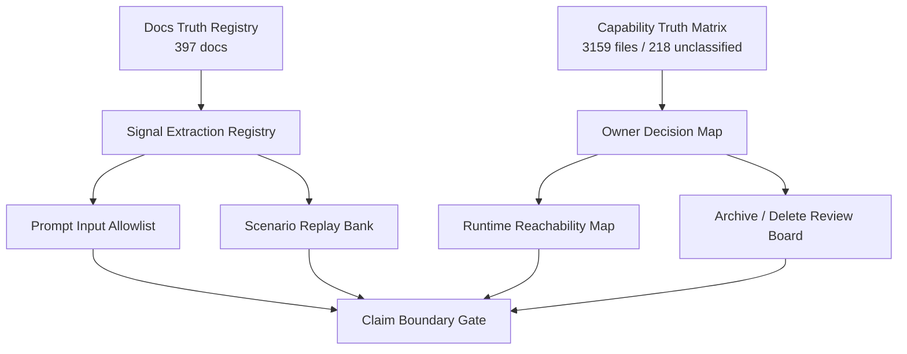

# DSXU V7 安全整理与信号吸收开发文档 - 20260519

## 0. 文档定位

V7 不是继续新增 runtime 功能，也不是删除清理批次。V7 是在 V6 已经形成 DeepSeek-Native Engineering Runtime 方向之后，对 DSXU 当前过多文档、过多功能、过多证据、过多历史入口进行一次安全收口：

1. 先分类。
2. 先吸收有价值经验。
3. 保留也要标明用途和 owner。
4. 不保留也先进入观察和 owner review。
5. 暂不删除任何文件。
6. 不允许把旧文档、实验、mock、smoke、历史代码误当成当前产品能力。

目标是让 DSXU 在 DeepSeek V4 Flash / Flash-MAX / Pro 混合模型基础上继续朝“高级程序员 90%+ 编程与复杂任务体验”推进，同时避免核心主链被越整越乱。

## 1. 已审核事实输入

V7 基于下面三份当前事实表，不重新发明分类口径。

| 输入 | 当前事实 | 用途 |
|---|---:|---|
| `DSXU_DOCS_TRUTH_REGISTRY_20260519` | docs 文件约 397 个 | 判断文档是当前、历史、证据、实验、发布、生成物还是需人工审查 |
| `DSXU_CAPABILITY_TRUTH_MATRIX_20260519` | 扫描文件 3159 个，未归类 218 个 | 判断代码/脚本/文档是否默认主链、CLI、测试合同、文档证据、实验、冻结、历史残留 |
| `DSXU_V6_OWNER_REVIEW_DECISIONS_20260519` | 218 个未归类项已二次归类 | 判断 218 个 owner review 项到底保留、冻结、证据化、发布限定还是进入删除审查 |

218 个 owner review 的当前结论：

| 决策 | 数量 | 解释 |
|---|---:|---|
| `mainline-owner` | 98 | 有真实 owner 或 active import 证据，倾向保留，但不能直接当公开卖点 |
| `release-only` | 12 | README/package/config/health/release 表面，保留但不进模型 prompt |
| `legacy` | 25 | 历史或冻结能力，默认不启用 |
| `evidence-only` | 71 | harness/test/evidence 专用，不当 runtime 能力 |
| `delete-review` | 12 | 疑似重复入口或第二套 runtime，只进入 owner/Git 审查，不直接删除 |

## 2. V7 核心目标

| 目标 | 说明 | 成功标准 |
|---|---|---|
| 文档不乱 | 397 个 docs 文件全部有 status、用途、删除安全等级、转化潜力 | 100% 有 registry 记录 |
| 信号不丢 | 高价值历史文档先抽取成结构化 signal | P0 文档每个至少抽出 1 个 runtime/test/scenario 信号 |
| 主链不乱 | 218 个 owner review 项不进入默认 prompt，除非被明确允许 | `claimAllowed=false`、`modelPromptAllowed=false` 保持为默认 |
| 旧入口不复活 | 12 个 delete-review 不直接删，也不进入默认体验 | 必须有 replacement evidence + owner signoff 才能后续处理 |
| Prompt 变轻 | DeepSeek 默认 prompt 只读 current master、active evidence、已抽取规则 | legacy/generated-historical/evidence-only 默认不进 prompt |
| 测试可验收 | 每一步都有脚本、单测、集成验收 | 不靠“人工感觉完成” |

## 3. 非目标

V7 明确不做下面这些事：

1. 不重写 query-loop。
2. 不新增第二套 DAG/PEV/runtime。
3. 不删除文件。
4. 不把历史 generated evidence 直接塞进模型上下文。
5. 不把 mock/smoke/internal replay 当公开 benchmark。
6. 不把 `mainline-owner` 自动升级成 public claim。
7. 不让 DeepSeek 看到所有旧计划和所有历史审计。
8. 不把 V7 当发布清理完成证明。

## 4. 总体架构

V7 只新增整理层和证据层，不触碰默认执行核心。



V7 的判断逻辑：

| 层 | 输入 | 输出 | 作用 |
|---|---|---|---|
| 文档真相层 | 397 docs | doc status / deleteSafety / transformPotential | 知道文档该保留、吸收、归档还是人工审查 |
| 信号抽取层 | 高价值 docs | runtime/test/scenario/prompt/release signals | 把旧经验转成可执行设计资产 |
| 代码归属层 | 218 owner review | mainline/release/legacy/evidence/delete-review | 防止旧代码被误当产品能力 |
| Prompt allowlist 层 | current docs + extracted signals | 允许进入默认 prompt 的最小上下文 | 降低 DeepSeek token 和认知负担 |
| Archive/delete board 层 | 历史/生成/重复入口 | 观察队列 | 不乱删，不复活第二套 runtime |

## 5. 文件处理策略

### 5.1 文档文件处理

| 文档类别 | 处理方式 | 是否可删 | 是否进默认 prompt |
|---|---|---|---|
| `active-master-plan` | 保留为当前主入口 | 否 | 可以摘要进入 |
| `active-v6-evidence` | 保留为当前证据 | 否 | 只进摘要，不进全文 |
| `active-public-doc` | 保留，做 claim 边界清理 | 否 | 仅公开声明相关摘要 |
| `active-reference` | 保留并抽取 replay/scenario | 否 | 抽取后的 signal 可进 |
| `evidence-audit` | 保留为审计证据 | 否 | 默认不进 |
| `historical-evidence` | 先抽取，再归档观察 | 否，除非完成 archive review | 不进 |
| `superseded-plan` | 抽取有效规则后归档观察 | 否，除非完成 archive review | 不进 |
| `superseded-review` | 抽取 owner/test/risk 信号 | 否，除非完成 archive review | 不进 |
| `generated-current` | 保留，必须可再生成 | 只允许删除再生成副本 | 不进全文 |
| `generated-historical` | 生成物归档观察 | 只允许有 generator 且可复现后处理 | 不进 |
| `asset` | 先做引用扫描 | 未引用可进入 archive review | 不进 |
| `manual-review` | 人工审查 | 否 | 不进 |

### 5.2 218 个 owner review 项处理

| 决策 | 处理方式 | 是否公开声明 | 是否默认 prompt | 是否删除 |
|---|---|---|---|---|
| `mainline-owner` | 保留，补 owner/test/reachability/live evidence | 证据齐全后才允许 | 默认仍不自动进入 | 否 |
| `release-only` | 保留为发布、配置、文档表面 | 只能声明为发布/配置支持 | 否 | 否 |
| `legacy` | 冻结，抽取设计经验 | 否 | 否 | 暂不删 |
| `evidence-only` | 保留为测试/harness/证据 | 否 | 否 | 暂不删 |
| `delete-review` | 进入 owner/Git 审查 | 否 | 否 | 需要 replacement evidence + owner approval |

## 6. V7 工作包

### V7-01：Signal Extraction Registry

目标：从 397 个文档中抽取可用信号，避免直接把旧文档全文塞进 prompt。

计划新增：

| 文件 | 用途 |
|---|---|
| `scripts/dsxu-doc-signal-extraction.ts` | 从 docs registry 中抽取结构化信号 |
| `scripts/__tests__/dsxu-doc-signal-extraction.test.ts` | 验证抽取规则 |
| `docs/generated/DSXU_DOC_SIGNAL_EXTRACTION_20260519.json` | JSON 全量信号 |
| `docs/generated/DSXU_DOC_SIGNAL_EXTRACTION_20260519.csv` | CSV 全量信号 |
| `docs/DSXU_DOC_SIGNAL_EXTRACTION_20260519.md` | Markdown 摘要 |

Signal schema：

```ts
type DsxuDocSignal = {
  sourceDoc: string
  sourceLines: string
  signalCategory:
    | 'prompt-discipline'
    | 'tool-protocol'
    | 'verification-recovery'
    | 'context-memory-ledger'
    | 'agent-skill-mcp'
    | 'deepseek-routing-cost-cache'
    | 'benchmark-hit-rate'
    | 'release-claim-boundary'
    | 'tui-trust-surface'
    | 'scenario-replay'
  summary: string
  targetOwner: string
  targetV6WorkPackage: string
  alreadyCovered: boolean
  missingRuntime: boolean
  missingTest: boolean
  promptAllowed: boolean
  claimAllowed: boolean
  archiveAfterExtraction: boolean
}
```

硬验收：

| 验收 | 标准 |
|---|---|
| P0 高价值文档覆盖 | 每个 P0 文档至少抽出 1 条 signal |
| 历史计划不进 prompt | `superseded-plan` 的原文 `promptAllowed=false` |
| claim 边界 | `claimAllowed=true` 必须有 source/test/live/benchmark 字段 |
| 输出可复现 | 重跑脚本输出 schema 一致 |

测试命令：

```bash
bun test scripts/__tests__/dsxu-doc-signal-extraction.test.ts
bun run scripts/dsxu-doc-signal-extraction.ts
```

### V7-02：Prompt Input Allowlist

目标：让 DeepSeek 默认只看到必要信息，防止 67+ 功能、40+ 工具、旧文档、历史计划污染推理。

计划新增：

| 文件 | 用途 |
|---|---|
| `scripts/dsxu-prompt-input-allowlist.ts` | 生成默认 prompt 可用输入表 |
| `scripts/__tests__/dsxu-prompt-input-allowlist.test.ts` | 验证 legacy/evidence/generated 不会进入默认 prompt |
| `docs/generated/DSXU_PROMPT_INPUT_ALLOWLIST_20260519.json` | prompt allowlist |
| `docs/DSXU_PROMPT_INPUT_ALLOWLIST_20260519.md` | 人类可读说明 |

允许进入默认 prompt 的内容：

| 内容 | 形式 |
|---|---|
| 当前任务 | 原文 |
| 当前工作记忆 | 摘要 |
| V6 主链规则 | 压缩摘要 |
| 已抽取 prompt-discipline signal | 短规则 |
| 当前工具白名单 | 短列表 |
| 当前验证/恢复策略 | 短合同 |

禁止进入默认 prompt 的内容：

| 内容 | 原因 |
|---|---|
| `generated-historical` | 太大，且容易污染当前事实 |
| `superseded-plan` 原文 | 容易复活旧方案 |
| `legacy` code/doc | 容易复活旧 runtime |
| `evidence-only` 全文 | 证据不等于运行能力 |
| `delete-review` 路径 | 禁止模型默认调用 |

硬验收：

```bash
bun test scripts/__tests__/dsxu-prompt-input-allowlist.test.ts
bun run scripts/dsxu-prompt-input-allowlist.ts
```

验收断言：

1. `delete-review` 路径数量必须为 0。
2. `generated-historical` 原文数量必须为 0。
3. `superseded-plan` 原文数量必须为 0。
4. allowlist 总 token 预算必须小于设定阈值。
5. 所有 prompt rule 必须来自 signal extraction 或 current master。

### V7-03：Runtime Reachability Map

目标：对 98 个 `mainline-owner` 做进一步真实性审核。`mainline-owner` 只能说明有 owner 或引用证据，不等于已经成为默认高级程序员体验。

计划新增：

| 文件 | 用途 |
|---|---|
| `scripts/dsxu-runtime-reachability-map.ts` | 检查 98 个 mainline-owner 是否默认链可达 |
| `scripts/__tests__/dsxu-runtime-reachability-map.test.ts` | 验证分类规则 |
| `docs/generated/DSXU_RUNTIME_REACHABILITY_MAP_20260519.json` | 全量 reachability 结果 |
| `docs/DSXU_RUNTIME_REACHABILITY_MAP_20260519.md` | 摘要 |

Reachability 分级：

| 级别 | 定义 | 可否声明 |
|---|---|---|
| R0 | 无 active import，仅 owner 保留 | 不可声明 |
| R1 | 有 active import，但不在默认任务链 | 不可公开声明 |
| R2 | 默认链静态可达 | 可内部声明，需测试 |
| R3 | 默认链可达 + 单测/集成通过 | 可写内部能力 |
| R4 | 默认链可达 + live/replay/benchmark 证据 | 可进入公开候选 |

硬验收：

1. 98 个 `mainline-owner` 全部有 R0-R4 级别。
2. R0/R1 不允许进入 README 能力声明。
3. R2 必须列出缺失测试。
4. R3/R4 必须列出测试命令。

测试命令：

```bash
bun test scripts/__tests__/dsxu-runtime-reachability-map.test.ts
bun run scripts/dsxu-runtime-reachability-map.ts
```

### V7-04：Archive Watchlist

目标：整理历史文档和生成物，但不删除。

计划新增：

| 文件 | 用途 |
|---|---|
| `scripts/dsxu-archive-watchlist.ts` | 生成归档观察列表 |
| `scripts/__tests__/dsxu-archive-watchlist.test.ts` | 验证不把 active/current 放进归档 |
| `docs/generated/DSXU_ARCHIVE_WATCHLIST_20260519.json` | 归档观察全量表 |
| `docs/DSXU_ARCHIVE_WATCHLIST_20260519.md` | 摘要 |

归档候选条件：

| 条件 | 处理 |
|---|---|
| `superseded-plan` 且 signal 已抽取 | archive-review |
| `generated-historical` 且 generator 可复现 | archive-review |
| asset 未被引用 | archive-review |
| historical evidence 但含 claim/release 风险 | keep-governance-evidence |

硬验收：

1. `deleteNow` 必须恒为 0。
2. `active-master-plan` 不得进入 archive-watchlist。
3. 有 release/IP/claim 风险的文件默认保留为 governance evidence。
4. 每个 archive candidate 必须有 `extractedSignalCount`。

### V7-05：Delete Review Board

目标：管理 12 个 `delete-review`，防止第二套 runtime，但不乱删。

当前 12 个：

| 文件组 | 风险 | V7 处理 |
|---|---|---|
| `src/commands/bridge-kick.ts` | 旧 bridge 入口 | replacement evidence 后才处理 |
| `src/commands/bridge/*` | 旧 bridge runtime | replacement evidence 后才处理 |
| `src/commands/commit.ts` | 旧 git 命令入口 | 确认新 git owner 后才处理 |
| `src/commands/commit-push-pr.ts` | 旧 git/PR 命令入口 | 确认新 git owner 后才处理 |
| `src/coordinator/dag/*` | 旧 DAG runtime | 确认 PlanGraph/Work-State 完全替代后才处理 |
| `src/services/swe-bench/*` | 旧 SWE bench owner | 确认新 eval owner 完全替代后才处理 |

计划新增：

| 文件 | 用途 |
|---|---|
| `scripts/dsxu-delete-review-board.ts` | 生成删除审查板 |
| `scripts/__tests__/dsxu-delete-review-board.test.ts` | 验证删除条件 |
| `docs/DSXU_DELETE_REVIEW_BOARD_20260519.md` | 人类审查表 |

删除前硬条件：

1. 有 replacement owner。
2. 有 replacement evidence。
3. 有反向引用扫描。
4. 有对应测试通过。
5. 有 owner signoff。
6. 用户明确批准删除。

任何一项缺失，状态只能是 `observe`，不能是 `delete-ready`。

### V7-06：Scenario Replay Bank

目标：把旧文档里的高级程序员场景变成 replay/test bank，而不是只留在文档里。

主要来源：

| 来源 | 转化内容 |
|---|---|
| `DSXU_REFERENCE_SCENARIO_BACKLOG_20260516.md` | 复杂任务场景 |
| `DSXU_REASONIX_COMPARATIVE_CODE_AUDIT_20260517.md` | 命中率优化和 cache-first 场景 |
| `DSXU_KARPATHY_SKILLS_ABSORPTION_PLAN_20260517.md` | 高级程序员行为纪律 |
| `DSXU_V18_V19_MERGED_AUDIT_20260510_CLEAN.md` | release/owner/test 历史场景 |

Replay 分层：

| 层级 | 用途 |
|---|---|
| mock replay | 快速验证脚本和规则 |
| internal replay | 验证 DSXU 默认主链 |
| fixture mutation replay | 验证真实代码修改 |
| live provider replay | 验证 DeepSeek API 真实能力 |
| external benchmark | 正式公开成绩候选 |

硬验收：

1. mock 不能当 live。
2. internal replay 不能当 external benchmark。
3. 每个 replay case 必须有 pass/fail 判定。
4. 每个 replay case 必须绑定能力 owner。

### V7-07：Claim Boundary Gate

目标：防止 DSXU 对外宣称超过 GPT-5.5 / Claude 4.7 时混用证据。

Claim 等级：

| 等级 | 允许说法 | 证据要求 |
|---|---|---|
| C0 | 内部设计目标 | 文档即可 |
| C1 | 源码存在 | source + owner |
| C2 | 单测证明 | unit/integration test |
| C3 | 默认链证明 | runtime reachability + replay |
| C4 | live provider 证明 | live DeepSeek provider evidence |
| C5 | 外部 benchmark 证明 | 可复现 benchmark |

禁止说法：

1. 用 mock 说真实成绩。
2. 用 source existence 说高级程序员体验。
3. 用历史文档说当前能力完成。
4. 用成本估算说“已超过 Claude/GPT”。
5. 用 `mainline-owner` 说默认用户已经可用。

硬验收：

```bash
bun run scripts/dsxu-claim-boundary-gate.ts
```

如果暂未实现该脚本，V7 必须至少生成 claim candidate 表，并人工阻断 C3 以下的公开能力声明。

### V7-08：V7 Safety Gate

目标：把 V7 所有整理动作合成一个安全门，防止“整理过程把核心整乱”。

计划新增：

| 文件 | 用途 |
|---|---|
| `scripts/dsxu-v7-safety-gate.ts` | 汇总所有 V7 验收 |
| `scripts/__tests__/dsxu-v7-safety-gate.test.ts` | 单测 |
| `docs/DSXU_V7_SAFETY_GATE_20260519.md` | 验收结果 |

Safety Gate 必须检查：

1. 没有删除文件。
2. 没有修改 `src/query.ts`、`src/Tool.ts`、`src/tools.ts` 等核心主链文件。
3. 397 docs 全部有分类。
4. 218 owner review 全部有决策。
5. 12 delete-review 没有进入 prompt allowlist。
6. legacy/evidence-only/generated-historical 没有进入默认 prompt。
7. P0 文档信号已抽取。
8. 公开 claim 没有引用 C3 以下证据。

## 7. 执行顺序

| 顺序 | 工作 | 是否改核心代码 | 产物 | 验收 |
|---:|---|---|---|---|
| 1 | 冻结当前事实输入 | 否 | baseline summary | registry/matrix/owner review 可重跑 |
| 2 | Signal Extraction Registry | 否 | signal json/csv/md | P0 docs 有 signal |
| 3 | Prompt Input Allowlist | 否 | allowlist | legacy/evidence/delete-review 不进 prompt |
| 4 | Runtime Reachability Map | 否 | reachability map | 98 mainline-owner 分级 |
| 5 | Archive Watchlist | 否 | archive board | `deleteNow=0` |
| 6 | Delete Review Board | 否 | delete board | 12 项全部 observe 或 blocked |
| 7 | Scenario Replay Bank | 否，除非只加 fixture | replay case list | mock/internal/live 分层 |
| 8 | Claim Boundary Gate | 否 | claim table | C3 以下不得公开 |
| 9 | V7 Safety Gate | 否 | final gate | 全部 PASS 才进入后续开发 |

## 8. 总体验收命令

第一组：已有事实可复现。

```bash
bun run scripts/dsxu-docs-truth-registry.ts
bun run scripts/dsxu-capability-truth-matrix.ts
bun run scripts/dsxu-v6-owner-cleanup-check.ts
bun run scripts/dsxu-v6-owner-review-decisions.ts
bun test scripts/__tests__/dsxu-v6-owner-review-decisions.test.ts
```

第二组：V7 新增整理验收。

```bash
bun test scripts/__tests__/dsxu-doc-signal-extraction.test.ts
bun test scripts/__tests__/dsxu-prompt-input-allowlist.test.ts
bun test scripts/__tests__/dsxu-runtime-reachability-map.test.ts
bun test scripts/__tests__/dsxu-archive-watchlist.test.ts
bun test scripts/__tests__/dsxu-delete-review-board.test.ts
bun test scripts/__tests__/dsxu-v7-safety-gate.test.ts
```

第三组：V7 汇总验收。

```bash
bun run scripts/dsxu-doc-signal-extraction.ts
bun run scripts/dsxu-prompt-input-allowlist.ts
bun run scripts/dsxu-runtime-reachability-map.ts
bun run scripts/dsxu-archive-watchlist.ts
bun run scripts/dsxu-delete-review-board.ts
bun run scripts/dsxu-v7-safety-gate.ts
```

## 9. 硬失败条件

任何一条出现，V7 判定失败：

1. 删除了文件。
2. 未经批准修改核心主链文件。
3. 12 个 `delete-review` 中任意一个进入默认 prompt。
4. `legacy` 或 `evidence-only` 被写成产品 runtime 能力。
5. `generated-historical` 原文进入默认 prompt。
6. 公开 claim 引用了 mock/smoke/internal replay 当外部 benchmark。
7. 当前 docs registry 有文件未分类。
8. 当前 owner review 有项没有 owner/decision/requiredNextAction。
9. P0 高价值文档没有被抽取成 signal。
10. V7 生成文件不可复现。

## 10. V7 完成后的状态

V7 完成后，DSXU 应该达到下面状态：

| 维度 | 完成状态 |
|---|---|
| 文档 | 当前 docs registry 文件都有用途、风险、转化方向 |
| 代码归属 | 当前 owner review 模糊项全部有 owner decision |
| Prompt | 默认 prompt 只使用 allowlist，不读历史噪音 |
| 旧功能 | legacy/evidence-only 不进入默认主链 |
| 删除 | 0 删除，仅观察 |
| 转化 | 高价值历史经验变成 signal、scenario、test target |
| 发布声明 | claim 分级，不再混用 mock/source/doc/live |
| DeepSeek 适配 | 低认知负担、低工具噪音、强 owner 约束 |

## 11. 负责人判断

V7 是必要的，但它不是“更强模型能力”的直接功能。它解决的是 DSXU 当前最危险的工程问题：

1. 功能越来越多，但默认链不够清晰。
2. 文档越来越多，但有效经验和历史噪音混在一起。
3. 工具和脚本越来越多，但模型容易误用。
4. 旧 runtime 和新 runtime 同时存在风险。
5. 发布声明容易被历史证据误导。

对 DeepSeek 来说，V7 的价值很高，因为弱模型最怕“选择面太大、历史上下文太乱、规则太厚”。V7 的本质是把 DSXU 的能力池变成可控的能力路由，而不是让 DeepSeek 在 67+ 功能和 40+ 工具里自己猜。

最终口径：

> V7 不追求新增能力数量，而追求能力可信、上下文干净、主链唯一、证据分层、旧经验可吸收、旧入口不误用。

## 12. V7 执行记录 - 2026-05-19

本轮已按 V7 安全收敛方案执行，重点是“先分类、先吸收、暂不删除、保留也处理、不保留先观察”。本轮没有删除文件，没有 stage/commit/reset，没有新增主链、runtime、provider、permission、ToolBus、Agent 或 TUI 层。

### 12.1 当前事实口径

V7 初稿中的 397 docs / 218 owner review / 12 delete-review 是写文档时的旧快照。本轮重新运行事实输入后，当前真实口径如下，后续 gate 已改为按当前 registry/owner summary 动态校验，不再硬套旧数字。

| 输入 | 当前事实 |
|---|---:|
| docs truth registry | 401 files |
| capability truth matrix | 3189 files |
| owner cleanup reviewed rows | 964 |
| owner cleanup unclassified rows | 208 |
| owner review rows | 208 |
| mainline-owner | 96 |
| release-only | 12 |
| legacy | 24 |
| evidence-only | 70 |
| delete-review | 6 |
| remaining classify-before-claim | 0 |
| claim/model prompt allowed from owner review | 0 |

### 12.2 本轮落地产物

| 产物 | 状态 | 用途 |
|---|---|---|
| `scripts/dsxu-doc-signal-extraction.ts` | PASS | 从历史/治理文档抽取 signal，不让原文噪音进 prompt |
| `scripts/dsxu-prompt-input-allowlist.ts` | PASS | 生成默认 prompt allowlist，阻止 legacy/evidence/delete-review/raw 历史内容进入默认上下文 |
| `scripts/dsxu-runtime-reachability-map.ts` | PASS | 对 mainline-owner 做 R0-R4 可达性分级，不产生公开 claim |
| `scripts/dsxu-archive-watchlist.ts` | PASS | 观察历史文档与可归档候选，`deleteNow=0` |
| `scripts/dsxu-delete-review-board.ts` | PASS | 6 个 delete-review 全部 observe，`deleteReady=0` |
| `scripts/dsxu-scenario-replay-bank.ts` | PASS | 把 signal 转成 mock/internal/live/external 分层 replay 候选，不允许内部 replay 冒充公开 benchmark |
| `scripts/dsxu-claim-boundary-gate.ts` | PASS | 阻止 C3 以下公开 claim，阻止 90%/外部榜单 claim |
| `scripts/dsxu-v7-owner-focused-evidence.ts` | PASS | 复跑 reachability map 指向的 focused owner tests，把手动验证变成可复现 owner evidence |
| `scripts/dsxu-v7-remaining-evidence-queue.ts` | PASS | 把未覆盖的 mainline-owner 行拆成可执行 owner-test 队列 |
| `scripts/dsxu-v7-delete-review-replacement-evidence.ts` | PASS | 汇总 6 个 delete-review observe 项的 replacement/import/use 证据，0 delete-ready，0 mutation-allowed |
| `scripts/dsxu-v7-scenario-replay-layer-evidence.ts` | PASS | 把 300 个 replay candidates 压成执行/阻断 evidence queue；mock/local 与 external paired raw 明确分层 |
| `scripts/dsxu-v7-safety-gate.ts` | PASS | 汇总 V7 安全门，14/14 PASS |

### 12.3 当前 V7 证据结果

| 报告 | 关键结果 |
|---|---|
| `docs/DSXU_DOC_SIGNAL_EXTRACTION_20260519.md` | 401 docs，3136 signals，328/328 P0 docs 有 signal，claimAllowed=0 |
| `docs/DSXU_PROMPT_INPUT_ALLOWLIST_20260519.md` | allowlistItems=12，blockedItems=3229，tokenBudget=8760/12000，deleteReviewPromptItems=0 |
| `docs/DSXU_RUNTIME_REACHABILITY_MAP_20260519.md` | mainlineOwnerRows=96，R2=96，publicClaimAllowedRows=0 |
| `docs/DSXU_ARCHIVE_WATCHLIST_20260519.md` | watchedRows=373，deleteNow=0，activeRowsInWatchlist=0 |
| `docs/DSXU_DELETE_REVIEW_BOARD_20260519.md` | deleteReviewRows=6，observeRows=6，deleteReadyRows=0 |
| `docs/DSXU_V7_DELETE_REVIEW_REPLACEMENT_EVIDENCE_20260519.md` | rows=6，replacementEvidenceRows=6，activeRuntimeReferenceRows=1，passedCommands=3，deleteReadyRows=0，mutationAllowedRows=0 |
| `docs/DSXU_SCENARIO_REPLAY_BANK_20260519.md` | totalCases=300，mock=251，external-benchmark=49，publicBenchmarkClaimAllowedRows=0 |
| `docs/DSXU_V7_SCENARIO_REPLAY_LAYER_EVIDENCE_20260519.md` | rows=300，mockContractPassRows=251，externalBenchmarkBlockedRows=49，publicClaimReadyRows=0 |
| `docs/DSXU_CLAIM_BOUNDARY_GATE_20260519.md` | public90Allowed=false，externalBenchmarkReady=false |
| `docs/DSXU_V7_OWNER_FOCUSED_EVIDENCE_20260519.md` | commands=44，passed=44，coveredRows=96，coveredOwners=10 |
| `docs/DSXU_V7_REMAINING_EVIDENCE_QUEUE_20260519.md` | totalRows=96，covered=96，needsFocusedOwnerTest=0，P0 pending=0，publicClaimAllowed=0 |
| `docs/DSXU_V7_SAFETY_GATE_20260519.md` | 14 checks，14 PASS，0 blocked |
| `docs/DSXU_V7_FINAL_CLOSURE_BOARD_20260519.md` | 8 checks，8 PASS，publicBenchmarkAllowed=false，deletionAllowed=false |
| `docs/DSXU_V7_COMPLETION_AUDIT_20260519.md` | 8 checks，8 PASS，13/13 work packages scripts/tests/reports present |

### 12.4 Focused 验收

已运行 V7 focused tests，不跑全量测试：

```bash
bun test scripts/__tests__/dsxu-v6-owner-review-decisions.test.ts scripts/__tests__/dsxu-doc-signal-extraction.test.ts scripts/__tests__/dsxu-prompt-input-allowlist.test.ts scripts/__tests__/dsxu-runtime-reachability-map.test.ts scripts/__tests__/dsxu-archive-watchlist.test.ts scripts/__tests__/dsxu-delete-review-board.test.ts scripts/__tests__/dsxu-scenario-replay-bank.test.ts scripts/__tests__/dsxu-claim-boundary-gate.test.ts scripts/__tests__/dsxu-v7-owner-focused-evidence.test.ts scripts/__tests__/dsxu-v7-remaining-evidence-queue.test.ts scripts/__tests__/dsxu-v7-safety-gate.test.ts src/dsxu/engine/__tests__/ui-shell-contract-registry.test.ts
```

结果：13 tests PASS，0 fail，89 expect calls。

已运行 V7 owner focused evidence，不跑全量测试：

```bash
bun run scripts/dsxu-v7-owner-focused-evidence.ts
bun run scripts/dsxu-v7-remaining-evidence-queue.ts
bun run scripts/dsxu-v7-safety-gate.ts
```

结果：44/44 owner verification commands PASS，覆盖 96 个 mainline-owner rows、10 个 owner；剩余队列确认 `needsFocusedOwnerTest=0`、`P0 pending=0`；V7 safety gate 保持 14/14 PASS，并已硬化为 remaining queue 不允许 focused owner test 缺口。

### 12.5 V7 完成裁决

V7 安全收敛本轮裁决为 `PASS_DSXU_V7_SAFETY_GATE`。这代表 DSXU 当前已经完成 V7 的分类、信号吸收、prompt allowlist、可达性分级、owner focused evidence、remaining evidence queue、观察板、claim 边界和安全门收口；不代表公开 benchmark、90% 能力声明、删除执行、归档执行或默认主链能力提升已经完成。

### 12.6 V7 内部队列当前状态

V7 不是全部完成后就可以发布 claim。当前 V7 内部队列已在后续 12.7-12.10 继续收口，最新状态如下：

| 队列 | 当前数量 | 当前状态 | 后续口径 |
|---|---:|---|---|
| mainline-owner 缺 focused owner test | 0 | 12.7 已闭合 | 后续只在代码变化后复跑 focused owner evidence |
| delete-review observe | 6 | 12.8 已形成 replacement evidence，仍 observe-only | 不是 V7 内部缺口；若要 mutation，必须另走 owner/Git signoff + 用户明确删除批准 |
| scenario replay candidates | 300 | 12.9 已形成 layer evidence，251 mock contract PASS，49 external blocked | 不是 V7 内部缺口；若要 public benchmark，必须另走 paired target raw evidence |
| final V7 closure | 1 | 12.10 已 PASS | 仅证明 V7 安全整理闭合，不等于 release/export/live/provider/public benchmark 完成 |

因此，V7 内部整理队列当前已闭合。剩余工作属于非 V7 gate：外部 paired raw benchmark、删除 mutation 审批、release/clean export、live DeepSeek provider claim evidence。

### 12.7 V7 owner evidence 继续处理记录

本轮继续处理了 `docs/DSXU_V7_REMAINING_EVIDENCE_QUEUE_20260519.md` 中的 P0 pending rows。处理方式不是补新 runtime，而是把已有 owner focused tests 反向映射回 reachability map，并新增一个 `ui-shell-contract-registry` focused contract test，证明 UI shell 只是 DSXU-owned contract projection，不拥有 policy/task/MCP/model 编排。

新增或更新的 focused evidence：

| owner | evidence |
|---|---|
| Query Loop / Execution Contract | accessibility、file-edit-adapter、ADR、brief/classify、bug-brain、checks-as-rules、circuit-breaker、coding pack、effort routing、file watcher、formatters、frontmatter、lifecycle、magic docs、patch engine、profiles、prompt router、budget guard、recovery、repo brain、retry、reviewer、runtime/session、slash/streaming/task queue/telemetry/token/transaction/verify-review/worktree/WSL/UI shell |
| Runtime Service Owner | LSP、mutation focused tests |
| Sandbox / Permission Boundary Owner | sandbox focused tests |
| Source Truth / Search Owner | embedding and search focused tests |
| Experience Evidence Owner | experience focused tests |
| Doctor / Release Preflight Owner | runtime health dry-path |
| MCP / Skill Registry Owner | MCP adapter focused tests |

当前 `mainline-owner` 96 行全部有 focused owner evidence。该结果仍然不等于公开 benchmark 或 90% claim，只表示 V7 owner evidence 缺口已闭合。

### 12.8 V7 delete-review replacement evidence 继续处理记录

本轮继续处理 `delete-review observe` 队列。处理目标不是删除，而是把 6 个候选项的 replacement evidence、import/use evidence、focused tests 和 mutation 边界统一写成可复跑审查包，防止后续把“有替代证据”误判成“已经可删”。

新增产物：

| 产物 | 结果 |
|---|---|
| `scripts/dsxu-v7-delete-review-replacement-evidence.ts` | 生成 delete-review replacement evidence，读取现有 delete board，不新增产品入口 |
| `scripts/__tests__/dsxu-v7-delete-review-replacement-evidence.test.ts` | 验证 replacement-covered 仍然 observe-only，且缺 replacement/test 时必须 BLOCKED |
| `docs/DSXU_V7_DELETE_REVIEW_REPLACEMENT_EVIDENCE_20260519.md` | 6/6 rows 有 replacement evidence，3/3 focused commands PASS |
| `docs/generated/DSXU_V7_DELETE_REVIEW_REPLACEMENT_EVIDENCE_20260519.json` | 机器可读审查包，供 V7 safety gate 校验 |

当前裁决：

| 指标 | 结果 |
|---|---:|
| delete-review rows | 6 |
| replacementEvidenceRows | 6 |
| activeRuntimeReferenceRows | 1 |
| focused replacement commands | 3 |
| passedCommands | 3 |
| failedCommands | 0 |
| deleteReadyRows | 0 |
| mutationAllowedRows | 0 |

6 个观察项的当前状态：

| path | 状态 | 裁决 |
|---|---|---|
| `src/commands/bridge/bridge.tsx` | `observe-active-runtime-reference` | 仍有 active runtime reference，必须继续 observe；不能进入删除执行 |
| `src/coordinator/dag/persist.ts` | `observe-replacement-covered` | replacement evidence 与 focused tests 通过；仍需 owner/Git signoff + 用户删除批准 |
| `src/coordinator/dag/templates.ts` | `observe-replacement-covered` | replacement evidence 与 focused tests 通过；仍需 owner/Git signoff + 用户删除批准 |
| `src/coordinator/dag/types.ts` | `observe-replacement-covered` | replacement evidence 与 focused tests 通过；仍需 owner/Git signoff + 用户删除批准 |
| `src/services/swe-bench/index.ts` | `observe-replacement-covered` | replacement evidence 与 focused tests 通过；仍需 owner/Git signoff + 用户删除批准 |
| `src/services/swe-bench/types.ts` | `observe-replacement-covered` | replacement evidence 与 focused tests 通过；仍需 owner/Git signoff + 用户删除批准 |

Focused 验证：

```bash
bun test scripts/__tests__/dsxu-v7-delete-review-replacement-evidence.test.ts scripts/__tests__/dsxu-v7-safety-gate.test.ts
bun run scripts/dsxu-v7-delete-review-replacement-evidence.ts
bun run scripts/dsxu-v7-safety-gate.ts
bun test scripts/__tests__/dsxu-v6-owner-review-decisions.test.ts scripts/__tests__/dsxu-doc-signal-extraction.test.ts scripts/__tests__/dsxu-prompt-input-allowlist.test.ts scripts/__tests__/dsxu-runtime-reachability-map.test.ts scripts/__tests__/dsxu-archive-watchlist.test.ts scripts/__tests__/dsxu-delete-review-board.test.ts scripts/__tests__/dsxu-v7-delete-review-replacement-evidence.test.ts scripts/__tests__/dsxu-scenario-replay-bank.test.ts scripts/__tests__/dsxu-claim-boundary-gate.test.ts scripts/__tests__/dsxu-v7-owner-focused-evidence.test.ts scripts/__tests__/dsxu-v7-remaining-evidence-queue.test.ts scripts/__tests__/dsxu-v7-safety-gate.test.ts src/dsxu/engine/__tests__/ui-shell-contract-registry.test.ts
```

结果：replacement evidence 单测 2 PASS；safety gate 单测 2 PASS；replacement evidence 生成 PASS，3/3 focused replacement commands PASS；V7 safety gate 更新为 14/14 PASS；V7 focused suite 17 PASS / 0 FAIL / 111 expect。没有删除、移动、stage、commit、reset 或清理文件。

### 12.9 V7 scenario replay layer evidence 继续处理记录

本轮继续处理 `scenario replay candidates` 队列。处理目标不是跑真实外部 benchmark，而是把 300 个 replay candidates 变成明确的执行/阻断 evidence queue：能本地确定性验证的只作为 mock contract；需要 external paired raw 的保持 blocked；任何 internal/mock/live 结果都不能升级成公开 benchmark claim。

新增产物：

| 产物 | 结果 |
|---|---|
| `scripts/dsxu-v7-scenario-replay-layer-evidence.ts` | 读取 replay bank，输出分层执行证据队列，不调用 live provider，不伪造 target raw |
| `scripts/__tests__/dsxu-v7-scenario-replay-layer-evidence.test.ts` | 验证 mock contract 可本地通过，external benchmark 无 paired raw 时必须 blocked |
| `docs/DSXU_V7_SCENARIO_REPLAY_LAYER_EVIDENCE_20260519.md` | 人读版分层执行证据 |
| `docs/generated/DSXU_V7_SCENARIO_REPLAY_LAYER_EVIDENCE_20260519.json` | 机器可读执行/阻断队列，已接入 V7 safety gate |

当前裁决：

| 指标 | 结果 |
|---|---:|
| replay rows | 300 |
| mockRows | 251 |
| mockContractPassRows | 251 |
| internalReadyRows | 0 |
| fixtureMutationReadyRows | 0 |
| liveProviderBlockedRows | 0 |
| externalBenchmarkBlockedRows | 49 |
| missingSourceDocRows | 0 |
| publicBenchmarkClaimAllowedRows | 0 |
| publicClaimReadyRows | 0 |

这代表：251 个 mock replay 只证明规则/fixture contract 可本地验证；49 个 external benchmark case 全部因为缺少 fixed manifest、paired target raw transcript、tool trace、cost/cache metrics 而保持 `BLOCKED_NEEDS_EXTERNAL_PAIRED_RAW`。V7 仍然不能声明外部 benchmark、90% 能力或公开胜出。

Focused 验证：

```bash
bun test scripts/__tests__/dsxu-v7-scenario-replay-layer-evidence.test.ts scripts/__tests__/dsxu-v7-safety-gate.test.ts
bun run scripts/dsxu-v7-scenario-replay-layer-evidence.ts
bun run scripts/dsxu-v7-safety-gate.ts
bun test scripts/__tests__/dsxu-v6-owner-review-decisions.test.ts scripts/__tests__/dsxu-doc-signal-extraction.test.ts scripts/__tests__/dsxu-prompt-input-allowlist.test.ts scripts/__tests__/dsxu-runtime-reachability-map.test.ts scripts/__tests__/dsxu-archive-watchlist.test.ts scripts/__tests__/dsxu-delete-review-board.test.ts scripts/__tests__/dsxu-v7-delete-review-replacement-evidence.test.ts scripts/__tests__/dsxu-scenario-replay-bank.test.ts scripts/__tests__/dsxu-v7-scenario-replay-layer-evidence.test.ts scripts/__tests__/dsxu-claim-boundary-gate.test.ts scripts/__tests__/dsxu-v7-owner-focused-evidence.test.ts scripts/__tests__/dsxu-v7-remaining-evidence-queue.test.ts scripts/__tests__/dsxu-v7-safety-gate.test.ts src/dsxu/engine/__tests__/ui-shell-contract-registry.test.ts
```

结果：scenario replay layer 单测 2 PASS；safety gate 单测 2 PASS；scenario replay layer 生成 PASS；V7 safety gate 更新为 14/14 PASS；V7 focused suite 17 PASS / 0 FAIL / 111 expect。没有删除、移动、stage、commit、reset 或清理文件。

### 12.10 V7 final closure board

本轮最后新增 `DSXU_V7_FINAL_CLOSURE_BOARD_20260519`，用于把 V7 的所有控制面收口成一个闭合裁决。它不是 release gate，不是 clean export，不是 public benchmark；它只说明 V7 安全整理本身已经闭合，且没有把任何 observe/mock/internal 结果误升级为删除、发布或公开能力声明。

新增产物：

| 产物 | 结果 |
|---|---|
| `scripts/dsxu-v7-final-closure-board.ts` | 汇总 V7 所有 evidence inputs，输出最终 closure board |
| `scripts/__tests__/dsxu-v7-final-closure-board.test.ts` | 验证只有在 safety gate、claim boundary、delete/replay/prompt 队列全部守住时才 PASS |
| `docs/DSXU_V7_FINAL_CLOSURE_BOARD_20260519.md` | V7 最终闭合报告 |
| `docs/generated/DSXU_V7_FINAL_CLOSURE_BOARD_20260519.json` | 机器可读闭合报告 |

当前裁决：

| 指标 | 结果 |
|---|---:|
| closure checks | 8 |
| passed | 8 |
| blocked | 0 |
| safetyGatePassed | true |
| publicBenchmarkAllowed | false |
| deletionAllowed | false |
| promptHistoricalRawAllowed | false |

Final closure 仍然明确留下非 V7 gate：

| 非 V7 gate | 状态 |
|---|---|
| external benchmark / public claim | 仍需 fixed manifest + paired target raw transcript + tool trace + final report + artifacts + metrics + risks |
| delete-review mutation | 仍需 owner/Git signoff + 用户明确删除批准 |
| release / clean export | 仍需 final release preflight、secret scan、fresh install smoke、当前 Git owner review |
| live-provider claim | 仍需真实 DeepSeek live evidence 与脱敏 raw logs |

Focused 验证：

```bash
bun test scripts/__tests__/dsxu-v7-final-closure-board.test.ts
bun run scripts/dsxu-v7-final-closure-board.ts
bun test scripts/__tests__/dsxu-v6-owner-review-decisions.test.ts scripts/__tests__/dsxu-doc-signal-extraction.test.ts scripts/__tests__/dsxu-prompt-input-allowlist.test.ts scripts/__tests__/dsxu-runtime-reachability-map.test.ts scripts/__tests__/dsxu-archive-watchlist.test.ts scripts/__tests__/dsxu-delete-review-board.test.ts scripts/__tests__/dsxu-v7-delete-review-replacement-evidence.test.ts scripts/__tests__/dsxu-scenario-replay-bank.test.ts scripts/__tests__/dsxu-v7-scenario-replay-layer-evidence.test.ts scripts/__tests__/dsxu-claim-boundary-gate.test.ts scripts/__tests__/dsxu-v7-owner-focused-evidence.test.ts scripts/__tests__/dsxu-v7-remaining-evidence-queue.test.ts scripts/__tests__/dsxu-v7-safety-gate.test.ts scripts/__tests__/dsxu-v7-final-closure-board.test.ts src/dsxu/engine/__tests__/ui-shell-contract-registry.test.ts
```

结果：final closure 单测 2 PASS；closure board 生成 PASS，8/8 checks PASS；V7 focused suite 20 PASS / 0 FAIL / 126 expect。没有删除、移动、stage、commit、reset 或清理文件。

### 12.11 V7 completion audit - 换角度复审

本轮按“漏网之鱼”角度重新审计 V7，不复用 final closure 的判断路径，而是从 V7 文档承诺、脚本存在性、测试存在性、报告存在性、过期 nextAction、public/delete/prompt 边界几个方向反向检查。

新增产物：

| 产物 | 结果 |
|---|---|
| `scripts/dsxu-v7-completion-audit.ts` | 独立完成度审计；检查 V7 work package 三件套、文档章节、claim/delete/prompt/replay 边界 |
| `scripts/__tests__/dsxu-v7-completion-audit.test.ts` | 验证当前 generated evidence 可以通过独立 completion audit |
| `docs/DSXU_V7_COMPLETION_AUDIT_20260519.md` | 人读版复审报告 |
| `docs/generated/DSXU_V7_COMPLETION_AUDIT_20260519.json` | 机器可读复审报告 |

复审结果：

| 指标 | 结果 |
|---|---:|
| completion audit checks | 8 |
| passed | 8 |
| blocked | 0 |
| workPackages | 13 |
| scriptsPresent | 13 |
| testsPresent | 13 |
| reportsPresent | 13 |
| v7InternalsClosed | true |

本轮发现并修正的漏项：

| 漏项 | 处理 |
|---|---|
| 12.6 仍保留旧 nextAction，写着下一步要处理 delete-review observe 和 scenario replay candidates | 已改成当前真实状态：12.8/12.9 已处理；V7 内部队列闭合，剩余属于非 V7 gate |

独立审计仍然确认以下不是 V7 已完成项：

| 非 V7 gate | 状态 |
|---|---|
| external/public benchmark paired raw evidence | 未完成，必须另行提供真实 paired target raw |
| delete mutation | 未完成，必须 owner/Git signoff + 用户明确删除批准 |
| release / clean export | 未完成，必须 release preflight、secret scan、fresh install、clean export |
| live DeepSeek provider public claim | 未完成，必须真实 live provider evidence 与脱敏 raw logs |

Focused 验证：

```bash
bun test scripts/__tests__/dsxu-v7-completion-audit.test.ts
bun run scripts/dsxu-v7-completion-audit.ts
bun test scripts/__tests__/dsxu-v6-owner-review-decisions.test.ts scripts/__tests__/dsxu-doc-signal-extraction.test.ts scripts/__tests__/dsxu-prompt-input-allowlist.test.ts scripts/__tests__/dsxu-runtime-reachability-map.test.ts scripts/__tests__/dsxu-archive-watchlist.test.ts scripts/__tests__/dsxu-delete-review-board.test.ts scripts/__tests__/dsxu-v7-delete-review-replacement-evidence.test.ts scripts/__tests__/dsxu-scenario-replay-bank.test.ts scripts/__tests__/dsxu-v7-scenario-replay-layer-evidence.test.ts scripts/__tests__/dsxu-claim-boundary-gate.test.ts scripts/__tests__/dsxu-v7-owner-focused-evidence.test.ts scripts/__tests__/dsxu-v7-remaining-evidence-queue.test.ts scripts/__tests__/dsxu-v7-safety-gate.test.ts scripts/__tests__/dsxu-v7-final-closure-board.test.ts scripts/__tests__/dsxu-v7-completion-audit.test.ts src/dsxu/engine/__tests__/ui-shell-contract-registry.test.ts
```

结果：completion audit 单测 1 PASS；completion audit 生成 PASS，8/8 checks PASS；V7 focused suite 20 PASS / 0 FAIL / 126 expect。没有删除、移动、stage、commit、reset 或清理文件。
